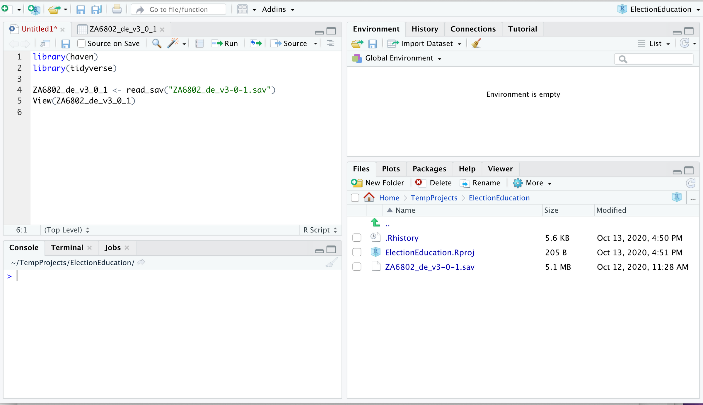
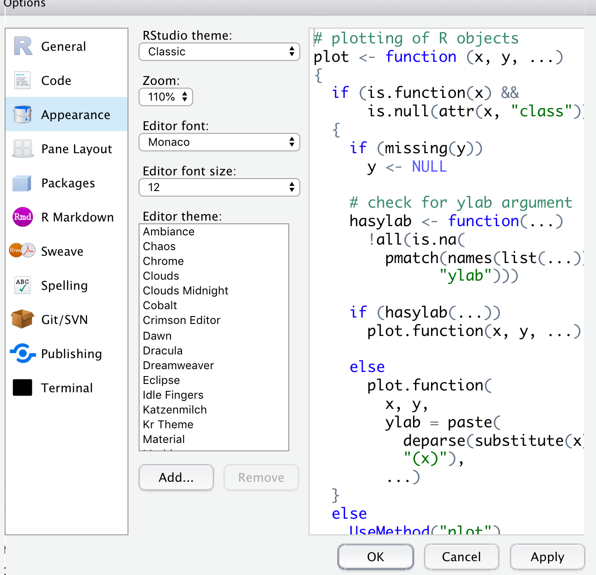

```{r setup, include=FALSE}
library(learnr)
tutorial_options(exercise.timelimit = 60)
```


## RStudio (Look & Feel)

Once you have installed [R](https://cran.r-project.org/) and [RStudio](https://rstudio.com/), you can start up RStudio and will see how this [IDE](https://en.wikipedia.org/wiki/Integrated_development_environment) is structured.

The view is essentially divided into four panes (three before you started a new script):

```{r rstudioview, echo=FALSE, fig.cap="The four panes of RStudio In the preferences you can reorder them as you like.", out.width = '100%'}

```

The one in the upper left is not visible when you first open RStudio, but will open when you open a text or script files. Script files are files containing your R code. They end with `.R`.

The one in the lower left is the `Console`. That is the place where you actually execute code (including from the script). Try typing `2+2` at the prompt and press return to let R do the "calculation" for you. You will notice that there are several other tabs in that pane. We will get to those at a later stage. For now just make sure that you are in the `Console` tab.

In the upper right is a pane for the `Environment` and `History`. The `Environment` is very central to our work, because it shows you to which libraries you currently have access and which variables and functions you have created. Especially in the beginning the `History` can jog your memory when you are asking yourself "How did I do this again?". You may also find a `Tutorial` tab here. The `Tutorial` makes use of the `learnR` package (which I am using as well for these tutorials).

The lower right is the defaul space for the `Files` in your working directory, `Plots` you have generated, and—very important—the `Help` tab. If you want to know what a function in R does and how you use it, just type `?` and then the function name into the `Console` and press return (e.g. `?c` for the very basic `c` function). In the `Help` tab you will then see a description of the function and how to use it.

### Exercise 

One of the very basic concepts in `R` is that we often write code in scripts in the upper left corner and then execute the code in the `Console`. Similarly to this web view here. Try it out by writing two plus two and execute the code by clicking the run button:

```{r two-plus-two, exercise=TRUE}

```

## Look & Feel (Modifications)

The whole look and feel of RStudio is modifiable. For instance, you can change the colours and fonts used in the preferences:

```{r rstudiomodify1, echo=FALSE, fig.cap="Some of the Settings in RStudio.", out.width = '50%'}

```

You can also change the order of the panes:

```{r rstudiomodify2, echo=FALSE, fig.cap="More of the Settings in RStudio.", out.width = '50%'}
knitr::include_graphics("images/RStudioModify2.png")
```

More importantly, the default settings of RStudio are set in a way that they try to save the last environment you have worked on when you exit RStudio and then reinstate this environment when RStudio starts up next. While this sounds like a good thing, if you work on multiple projects it is not. Data analysis consists not only of the data, but also of their transformation. If you have modified an object in R and you have chosen the default settings, then you would have to remember where you are in your script. This gets messy, really quick. A better way is to either start from scratch with your initial data and your script or if the script contains algorithm that take a loooong time, manually save the environment under a meaningful name and write a comment in your script.

In order to enable you to do so and be tidier in your approach to data analysis with `R`, you should open the preferences go to `General` and untick `Restore .RData into workspace at startup` and choose `Never` for `Save workspace to .RData on exit`. Believe me, in the long run this will make your life a lot easier.

### Quick questions

```{r quiz, echo=FALSE}
quiz(
  question("True or False: Code written in the script pane are automatically executed",
    answer("No, I have to either copy them to the console or press the run button.", correct = TRUE),
    answer("Sure!")
  ),
  question("Where do you write R-Code?",
    answer("console pane", correct = TRUE),
    answer("environment pane"),
    answer("plots pane"),
    answer("script pane", correct = TRUE)
  )
)
```

